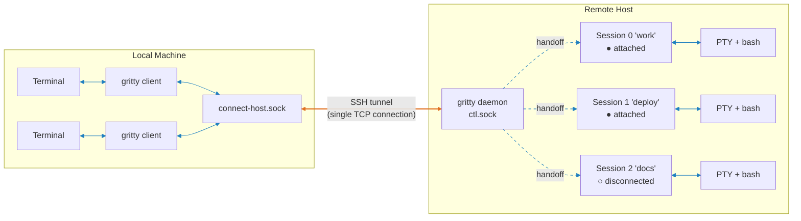
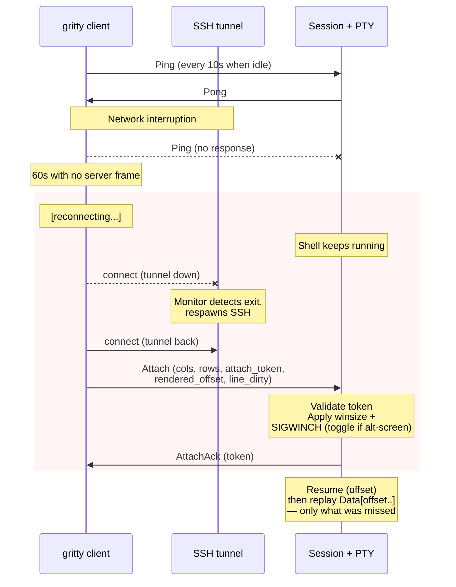
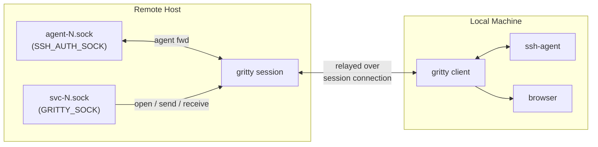

# Architecture

## Overview

Orange = SSH tunnel (TCP) · Blue = Unix domain socket

A daemon listens on a single Unix socket (`ctl.sock`). Clients send a control frame declaring intent (new session, attach, list); the daemon hands off the raw socket connection to the target session and gets out of the loop. Each session owns a PTY with a login shell that persists across disconnects. The server keeps an always-on, offset-indexed byte history of PTY output (a trailing ~1MB ring plus a monotonic stream offset) so the shell never blocks and a reconnecting client can resume the stream by absolute position. On reconnect the client reports how far it rendered and the server replays exactly the bytes it missed -- nothing already on screen is re-sent.

For remote access, `gritty tunnel-create` forwards the remote socket over SSH. All commands work identically over the tunnel. `gritty bootstrap <host>` installs gritty on the remote host by running the install script over SSH.

## Self-Healing Reconnect

The client probes for liveness on idle and declares the link dead after 60s with no server frame. It then enters a reconnect loop with exponential backoff (1s..10s) and a per-attempt handshake+Attach budget of 15s -- generous enough to absorb cellular RTT plus a retransmit.

Resumption is offset-based. The client tracks how far it has rendered into the PTY output stream; the `Attach` frame carries that `rendered_offset`, and the server replays exactly `Data[rendered_offset..]` -- the bytes produced while the client was gone, and nothing else. A sub-second blip is therefore byte-exact and invisible: the client paints no status line at all unless the reconnect drags past a one-second grace period, so the terminal is never even touched. Only a longer outage gets chrome -- a single dim animated status line, erased on success. If the client's position fell out of the server's ~1MB history window it gets a truncation marker instead; a fresh `connect` (not an auto-reconnect) gets scrollback context under a dim divider; and an alt-screen session gets a full TUI repaint (a byte suffix can't reconstruct a live TUI). Meanwhile the tunnel monitor detects the SSH process exit and respawns it. The client reconnects through the restored tunnel transparently.

On macOS, both the client and the tunnel supervisor subscribe to `nw_path_monitor` (Network.framework) for OS-level network path-change hints -- wifi join/leave, ethernet plug/unplug, VPN up/down, wake-from-sleep route restore. A path-change event is advisory: the client sends an immediate Ping (surfacing a dead socket without waiting 60s), and any in-progress backoff sleep is cut short with backoff reset to the minimum. This is a latency optimization only; the wall-clock heartbeat and ssh's `ServerAliveInterval` remain the correctness backstops on every platform.

Each `Attach` carries an `attach_token` that the daemon minted on the previous successful attach. A stale token -- which happens when another client legitimately took over the session while this one was disconnected -- is rejected with `OwnerChanged`, and the client exits rather than silently stealing the session back. A matching token is a silent reconnect and returns the same token so an in-flight `AttachAck` loss can't poison future reconnects.

The tunnel supervisor -- ssh child lifecycle, app-layer probing, exponential backoff, remote-ready re-priming, and the `healthy` / `reconnecting` / `stale` status values -- has its own state machine documented separately; see [docs/tunnel-state-machine.md](docs/tunnel-state-machine.md).

## Self-Healing Daemon Lifecycle

The daemon's identity on disk -- its socket, pid file, and version sidecar -- can be deleted out from under it: systemd wipes `/run/user/<uid>` when the user's last login session ends, and `/tmp` gets age-based sweeps. A daemon that loses its socket is unreachable forever, invisible to every gritty command, and historically had to be found and killed by hand.

Three mechanisms close that gap. First, the daemon runs a periodic socket self-check: if its socket vanished, it re-creates the directory and re-binds at the same path -- sessions survive -- and if the path cannot be reclaimed (a newer daemon already took it, or the directory cannot be recreated) it shuts down cleanly rather than linger as an orphan. Second, `gritty doctor` and `gritty refresh` reconcile the process table against on-disk registrations (Linux): daemons that are running but unregistered -- orphans from older gritty releases, which cannot self-heal -- are reported by `doctor` and reaped by `refresh` after a grace period that spares any daemon still able to recover on its own. Third, `gritty refresh <host>` finishes with an end-to-end protocol probe through the tunnel, catching the case where every process is "current" relative to its own binary but the remote binary itself is a different release -- the one form of staleness per-process checks cannot see -- and prescribing the fix (`gritty bootstrap <host>`).

## Agent & URL Forwarding

Forwarding multiplexes over the existing session connection -- no extra tunnels.

**SSH agent forwarding** (off by default; enable with `-A`): the session always exports `SSH_AUTH_SOCK` pointing at `agent-N.sock`, but binds a listener on that path only while an `-A` client is attached. When a remote process (e.g. `git push`) connects, the request is relayed to the client's local SSH agent and back. Rate limited to 10 agent opens per 30 seconds. While no `-A` client is attached the path has no listener, so a process using `SSH_AUTH_SOCK` (e.g. `ssh-add -l`) gets a connection refused and reports "cannot connect to agent" (exit 2) -- an honest "no agent" rather than a socket that accepts and immediately closes. A later `-A` reattach rebinds the same path, activating the already-exported env var.

**URL open forwarding** (on by default; disable with `--no-forward-open`): the session creates a `gritty-open` symlink in the socket dir (pointing to the gritty binary) and sets `BROWSER` to that path. The binary detects `argv[0] == "gritty-open"` and dispatches to the open logic, so `$BROWSER` is a single path with no spaces. When invoked, the URL is relayed to the client which opens it locally. `OpenUrl` frames are only processed when `forward_open` is enabled on the client, and are rate limited to 2 per 30 seconds. **OAuth callback tunneling:** if the URL contains a `redirect_uri` pointing to `localhost` or `127.0.0.1`, gritty automatically creates a multi-channel reverse TCP tunnel (with idle timeout) so the OAuth callback reaches the remote program -- this binds a TCP port on your local machine for the duration of the callback. This handles the common case where a CLI tool opens a browser for OAuth login and waits for the redirect on a local port. Disable with `--no-oauth-redirect`; adjust the accept timeout with `--oauth-timeout <seconds>` (default: 180). Note that URL open forwarding is a trust grant -- it gives processes inside the remote session the ability to open URLs and bind TCP ports on your local machine. Only use it with sessions you control.

**Port forwarding** is client-initiated only. The `lf`/`rf` commands communicate with the client process through a local forward socket (`fwd-{host}-{session}.sock`), and the client sends `PortForwardRequest` frames to the server. A compromised server cannot initiate port forwards. All forwarding binds to `127.0.0.1` only.

**Clipboard forwarding** (requires `CAP_CLIPBOARD` negotiation): `gritty copy` inside a session relays clipboard data through the svc socket and session connection to the client. The client interacts with the local system clipboard. Clipboard is push-only -- the server can push `ClipboardSet` to the client (rate limited to 5 per 30s), but `ClipboardGet` always returns empty. This prevents a compromised server from reading the client clipboard.

## Single-Socket Protocol

All communication goes through one Unix domain socket per server instance. The wire format is `[type: u8][length: u32 BE][payload]`. Every connection starts with a Hello/HelloAck version handshake (which also negotiates capabilities via a `u32` bitfield), then a control frame declares intent.

For session relay, the daemon hands off the raw `UnixStream` to the session task -- the daemon is no longer in the data path. Session frames include Data (PTY I/O), Resize, Ping/Pong, Env, and the various forwarding frames (Agent, Open, Tunnel, PortForward, Send).

See [docs/wire-protocol.md](docs/wire-protocol.md) for the full protocol reference.

## Security Model

- **No network protocol** -- Unix domain sockets locally, SSH for remote access
- **Socket permissions** -- `0600` sockets, `0700` directories, `umask(0o077)` at startup
- **Peer UID verification** -- every `accept()` checks `SO_PEERCRED`
- **Frame size limits** -- decoder rejects payloads > 1 MB
- **Resize clamping** -- values clamped to 1..=10000
- **Symlink rejection** -- `/tmp` fallback directories validated for ownership
- **Client-initiated port forwarding** -- port forwards requested via client-side forward socket and `PortForwardRequest` frames; server cannot initiate forwards
- **Client-side gates** -- URL opening (`--forward-open`), agent forwarding (`-A`), and clipboard read are all gated on the client
- **Rate limiting** -- `OpenUrl` (2/30s), `ClipboardSet` (5/30s), `TunnelListen` (2/30s), `AgentOpen` (10/30s)
- **Audit logging** -- info/warn level logging for all security-sensitive operations on client and server
- **Runtime log control** -- SIGUSR1 cycles daemon log level without restart; SIGUSR2 reopens log file for external logrotate
