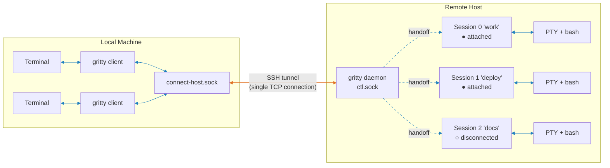
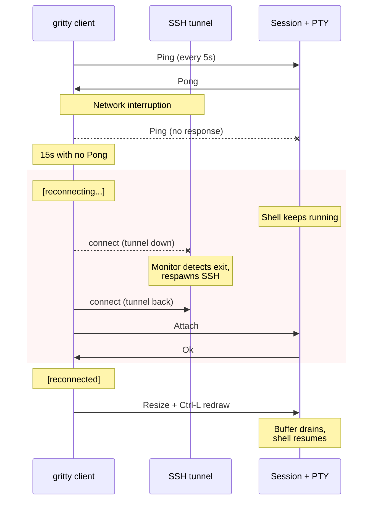
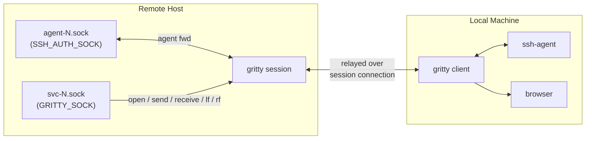

# Architecture

## Overview

Orange = SSH tunnel (TCP) · Blue = Unix domain socket

A daemon listens on a single Unix socket (`ctl.sock`). Clients send a control frame declaring intent (new session, attach, list); the daemon hands off the raw socket connection to the target session and gets out of the loop. Each session owns a PTY with a login shell that persists across disconnects -- while no client is attached, the server drains PTY output into a ring buffer so the shell never blocks. On reconnect, buffered output is flushed to the new client.

For remote access, `gritty tunnel-create` forwards the remote socket over SSH. All commands work identically over the tunnel.

## Self-Healing Reconnect

The client pings every 5 seconds; no pong within 15 seconds means dead connection. The client enters a reconnect loop (retry every 1s, Ctrl-C to abort). Meanwhile, the tunnel monitor detects the SSH process exit and respawns it. The client reconnects through the restored tunnel transparently.

## Agent & URL Forwarding

Forwarding multiplexes over the existing session connection -- no extra tunnels.

**SSH agent forwarding** (on by default; disable with `--no-forward-agent`): the session creates `agent-N.sock` and sets `SSH_AUTH_SOCK`. When a remote process (e.g. `git push`) connects, the request is relayed to the client's local SSH agent and back.

**URL open forwarding** (on by default; disable with `--no-forward-open`): the session sets `GRITTY_SOCK` and `BROWSER=gritty open`. When `gritty open <url>` runs, the URL is relayed to the client which opens it locally. **OAuth callback tunneling:** if the URL contains a `redirect_uri` pointing to `localhost` or `127.0.0.1`, gritty automatically creates a multi-channel reverse TCP tunnel (with idle timeout) so the OAuth callback reaches the remote program -- this binds a TCP port on your local machine for the duration of the callback. This handles the common case where a CLI tool opens a browser for OAuth login and waits for the redirect on a local port. Disable with `--no-oauth-redirect`; adjust the accept timeout with `--oauth-timeout <seconds>` (default: 180). Note that URL open forwarding is a trust grant -- it gives processes inside the remote session the ability to open URLs and bind TCP ports on your local machine. Only use it with sessions you control.

## Single-Socket Protocol

All communication goes through one Unix domain socket per server instance. The wire format is `[type: u8][length: u32 BE][payload]`. Every connection starts with a Hello/HelloAck version handshake, then a control frame declares intent.

For session relay, the daemon hands off the raw `UnixStream` to the session task -- the daemon is no longer in the data path. Session frames include Data (PTY I/O), Resize, Ping/Pong, Env, and the various forwarding frames (Agent, Open, Tunnel, PortForward, Send).

See `CLAUDE.md` for the full protocol reference.

## Security Model

- **No network protocol** -- Unix domain sockets locally, SSH for remote access
- **Socket permissions** -- `0600` sockets, `0700` directories, `umask(0o077)` at startup
- **Peer UID verification** -- every `accept()` checks `SO_PEERCRED`
- **Frame size limits** -- decoder rejects payloads > 1 MB
- **Resize clamping** -- values clamped to 1..=10000
- **Symlink rejection** -- `/tmp` fallback directories validated for ownership
