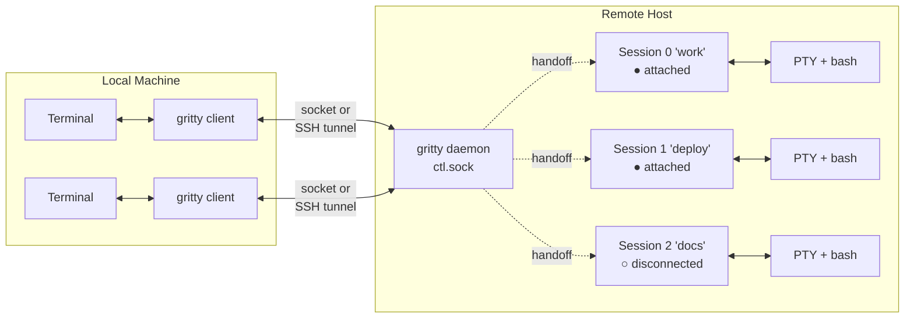
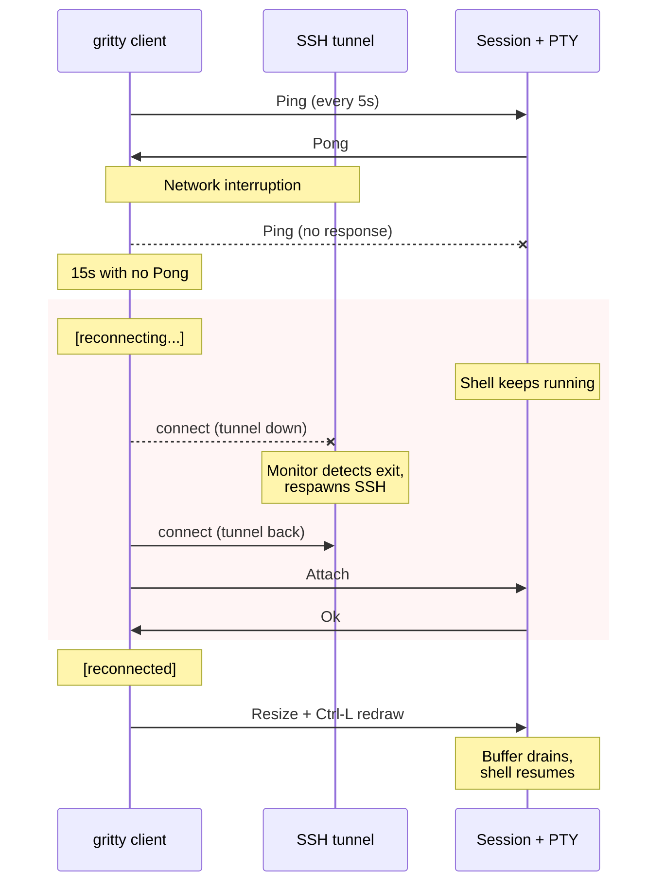
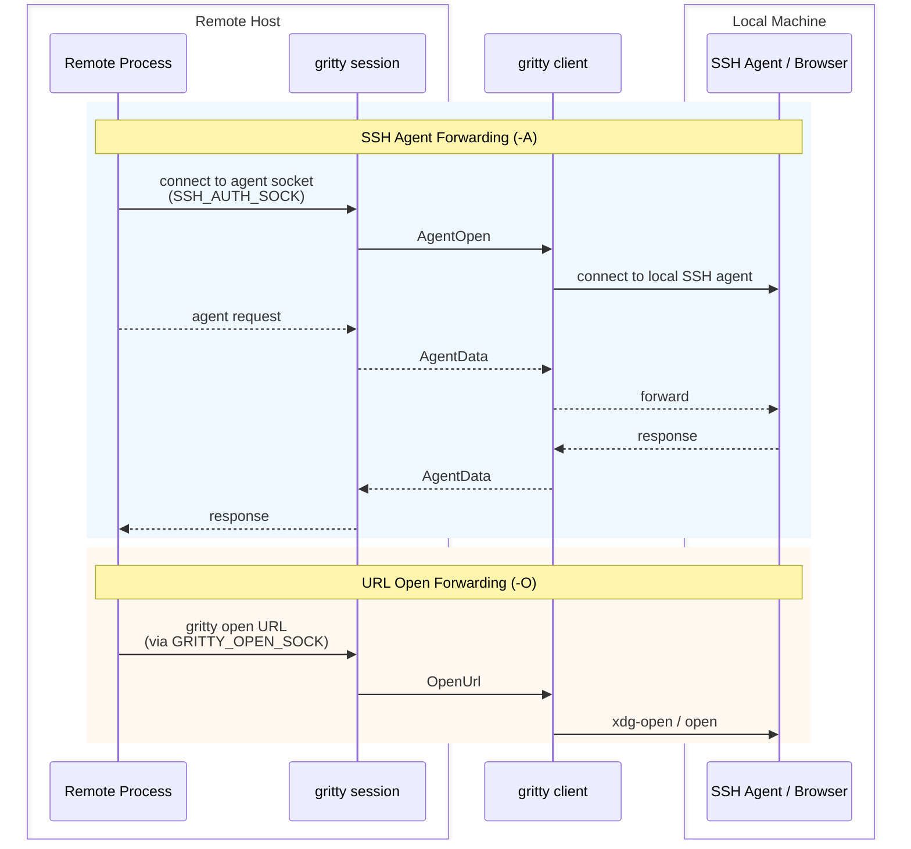

# gritty

Persistent, self-healing terminal sessions over SSH.

gritty gives you remote shell sessions that survive network changes, laptop sleep, and SSH disconnects. Close your laptop, change networks, reconnect your VPN — gritty detects the dead connection, respawns the SSH tunnel, and picks up where you left off. Your session never dies.

It works by forwarding Unix domain sockets over SSH — no custom protocol, no open ports, no certificates, no configuration. If you can `ssh` to a host, you can use gritty.

## Features

- **Self-healing connections** — heartbeat detection, automatic tunnel respawn, transparent client reconnect
- **SSH agent forwarding** — `--forward-agent` / `-A` tunnels your local SSH agent through gritty sessions, so `git push`, `ssh`, and other agent-dependent commands work on the remote host as if you were local
- **URL open forwarding** — `--forward-open` / `-O` forwards URL open requests back to your local machine, so `cargo doc --open`, `python -m webbrowser`, and anything using `$BROWSER` opens locally
- **Persistent sessions** — shells survive client disconnect, network failure, laptop sleep
- **Single binary, zero config** — no server config, no port allocation, no root required; gritty auto-starts the remote server for you
- **No network protocol** — Unix domain sockets locally, SSH handles encryption and auth
- **SSH-style escape sequences** — `~.` detach, `~^Z` suspend, `~?` help
- **Environment forwarding** — TERM, LANG, COLORTERM propagated to remote shell
- **Multiple named sessions** — create, list, attach, kill by name or ID

## Quick Start

```bash
# Build and install
cargo build --release
cp target/release/gritty ~/.local/bin/  # or somewhere in your PATH
```

### Connect to a remote host

One command sets up an SSH tunnel, starts the remote server, and returns:

```bash
gritty connect user@devbox
```

Create sessions, attach, detach, reattach — all through the tunnel:

```bash
# Create a named session (auto-attaches)
gritty new devbox -t work

# Detach with ~. or just close your terminal

# Reattach from any terminal
gritty attach devbox -t work

# Forward your SSH agent for git/ssh on the remote host
gritty new devbox -t deploy -A

# Forward URL opens back to your local browser
gritty new devbox -t docs -O

# List sessions
gritty ls devbox

# Manage tunnels
gritty tunnels           # list active tunnels
gritty disconnect devbox # tear down
```

`gritty ls devbox` output:

```
ID  Name    PTY         PID    Created              Status
0   work    /dev/pts/4  48291  2026-02-21 14:32:07  attached (heartbeat 3s ago)
1   deploy  /dev/pts/5  48305  2026-02-21 14:33:41  detached
```

### Local usage

gritty also works locally without SSH — useful for persistent sessions that survive terminal close:

```bash
gritty server            # start local server (self-backgrounds)
gritty new -t scratch    # create a session
gritty attach -t scratch # reattach later
gritty kill-server       # clean up
```

## Commands

| Command | Aliases | Description |
|---------|---------|-------------|
| `gritty connect user@host` | `c` | Set up SSH tunnel to remote host |
| `gritty disconnect <name>` | `dc` | Tear down an SSH tunnel |
| `gritty tunnels` | `tun` | List active SSH tunnels |
| `gritty new-session [host] [-t name]` | `new` | Create a session and auto-attach |
| `gritty attach [host] -t <id\|name>` | `a` | Attach to a session |
| `gritty list-sessions [host]` | `ls`, `list` | List sessions |
| `gritty kill-session [host] -t <id\|name>` | | Kill a session |
| `gritty kill-server [host]` | | Kill the server and all sessions |
| `gritty open <url>` | | Open a URL on the local machine (inside sessions) |
| `gritty server` | `s` | Start a local server |

The `[host]` argument is a connection name from `gritty connect` (e.g., `gritty ls devbox`). Omit it to use the local server.

**Notable options:**
- `-A` / `--forward-agent` on `new`/`attach`: forward your local SSH agent
- `-O` / `--forward-open` on `new`/`attach`: forward URL opens to local machine
- `-t <name>` on `new`/`attach`: target session by name or ID
- `-n <name>` on `connect`: override connection name (defaults to hostname)
- `-o <option>` on `connect`: extra SSH options (repeatable, e.g., `-o "ProxyJump=bastion"`)

## Escape Sequences

After a newline (or at session start), `~` enters escape mode:

| Sequence | Action |
|----------|--------|
| `~.` | Detach from session (clean exit, no auto-reconnect) |
| `~^Z` | Suspend the client (SIGTSTP) |
| `~?` | Print help |
| `~~` | Send a literal `~` |

## Design

### No Network Protocol

gritty contains zero networking code. Sessions live on Unix domain sockets. For remote access, you forward the socket over SSH — the same SSH that already handles your keys, your `.ssh/config`, your bastion hosts, your MFA.

No ports to open, no firewall rules, no TLS certificates, no authentication system to trust beyond the one you already use.

### Security by Composition

gritty delegates encryption and authentication to SSH rather than reimplementing them. Locally, the socket is `0600`, the directory is `0700`, and every `accept()` verifies the peer UID. The attack surface is small because there's very little to attack.

### Single-Socket Architecture

All communication — control messages and session relay — flows through one server socket. When a client connects to a session, the server hands off the raw connection and gets out of the loop. No per-session sockets, no port allocation, no cleanup races.

### Persistence Model

The PTY and shell process keep running when the client disconnects. While disconnected, the shell blocks on write when its kernel PTY buffer fills up (~4KB) and resumes when a new client drains it. There's no scroll-back replay or screen reconstruction — just a live PTY that never dies.

## How It Works

### Architecture



A daemon listens on a single Unix socket (`ctl.sock`). Clients send a control frame declaring intent (new session, attach, list); the daemon hands off the raw socket connection to the target session and gets out of the loop. Each session owns a PTY with a login shell that persists across disconnects — while no client is attached, the shell blocks on its kernel PTY buffer (~4KB) and resumes instantly on reconnect.

For remote access, `gritty connect` forwards the remote socket over SSH. All commands work identically over the tunnel.

### Self-Healing Reconnect



The client pings every 5 seconds; no pong within 15 seconds means dead connection. The client enters a reconnect loop (retry every 1s, Ctrl-C to abort). Meanwhile, the tunnel monitor detects the SSH process exit and respawns it. The client reconnects through the restored tunnel transparently.

### Agent & URL Forwarding



Both features multiplex over the existing session connection — no extra sockets or tunnels.

**SSH agent forwarding** (`-A`): a per-session agent socket on the remote host (`SSH_AUTH_SOCK`) relays requests back to your local SSH agent via bidirectional channel IDs. Commands like `git push` and `ssh` work as if you were local.

**URL open forwarding** (`-O`): `GRITTY_OPEN_SOCK` and `BROWSER=gritty open` are set in the shell. When `gritty open <url>` runs (directly or via `$BROWSER`), the URL is relayed to the client which opens it with the local browser.

## Prior Art

- [mosh](https://mosh.org/) — persistent remote terminal using UDP and SSP
- [Eternal Terminal](https://eternalterminal.dev/) — persistent SSH sessions over a custom protocol
- [tmux](https://github.com/tmux/tmux) / [screen](https://www.gnu.org/software/screen/) — terminal multiplexers with session persistence

gritty differs by having no network protocol of its own. Where mosh and ET implement custom transport and encryption, gritty uses Unix domain sockets and delegates networking entirely to SSH. Where tmux and screen are full multiplexers with windows, panes, and key bindings, gritty does one thing: persistent sessions with auto-reconnect.

## Status & Roadmap

Early stage. Works on Linux and macOS. Not yet packaged for distribution.

**Planned:**
- **Server auto-start** — start the server on demand (systemd socket activation, launchd, or on first `new-session`)
- **Zero-downtime upgrades** — server re-execs itself, preserving sessions across upgrades
- **Read-only attach** — multiple clients viewing the same session for pair programming or demos

## License

MIT OR Apache-2.0
