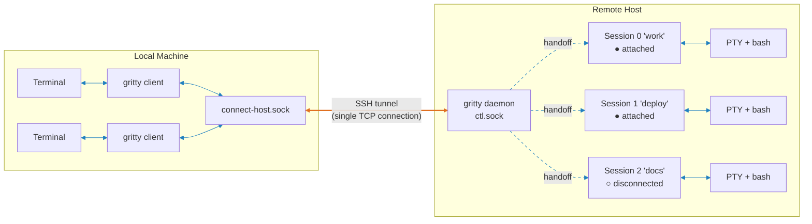
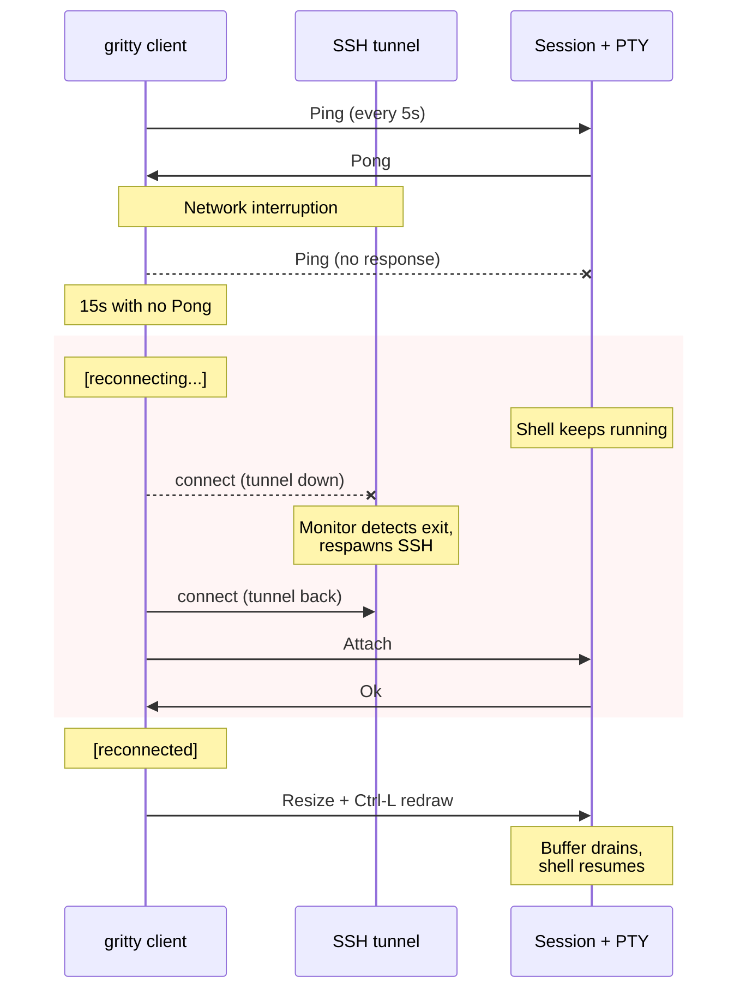
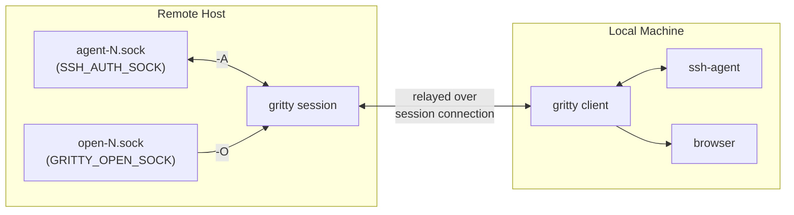

# gritty

Persistent, self-healing terminal sessions over SSH for smooth remote development.

gritty gives you seamless, robust remote shell sessions that survive network changes, laptop sleep, and SSH disconnects. Close your laptop, change networks, reconnect your VPN -- gritty detects the dead connection, respawns the SSH tunnel, and picks up where you left off.  gritty also optionally forwards your `ssh-agent` and will handle remote requests to open URLs via `$BROWSER`.

It works by forwarding Unix domain sockets over SSH -- no custom protocol, no open ports, no certificates, no configuration. If you can `ssh` to a host, you can use gritty for reliable remote development.

## Features

- **Reliable**
    - **Self-healing connections** -- heartbeat detection, automatic tunnel respawn, transparent client reconnect
    - **Persistent sessions** -- shells survive client disconnect, network failure, laptop sleep
- **Remote development**
    - **SSH agent forwarding** (`-A`) -- tunnels your local SSH agent so `git push`, `ssh`, and other agent-dependent commands work remotely
    - **URL open forwarding** (`-O`) -- forwards `$BROWSER` / URL open requests back to your local machine
    - **Environment forwarding** -- TERM, LANG, COLORTERM propagated to remote shell
- **Simple**
    - **Single binary, zero config** -- optional TOML config for defaults; no server config, no port allocation, no root required; auto-starts the server on demand
    - **No network protocol** -- Unix domain sockets locally, SSH handles encryption and auth
- **Session management**
    - **Multiple named sessions** -- create, list, attach, kill by name or ID
    - **SSH-style escape sequences** -- `~.` detach, `~^Z` suspend, `~?` help

## Quick Start

```bash
cargo install gritty-cli
```

### Connect to a remote host

One command sets up an SSH tunnel, starts the remote server, and returns:

```bash
gritty connect user@devbox
```

Create sessions, attach, detach, reattach -- all through the tunnel:

```bash
# Create a named session (auto-attaches)
gritty new devbox -t work

# Detach with ~. or just close your terminal

# Reattach from any terminal
gritty attach devbox -t work

# Forward your SSH agent for git/ssh on the remote host
gritty new devbox -t deploy -A

# Forward URL opens back to your local browser
gritty new devbox -t docs -O

# List sessions
gritty ls devbox

# Manage tunnels
gritty tunnels           # list active tunnels
gritty disconnect devbox # tear down
```

`gritty ls devbox` output:

```
ID  Name    PTY         PID    Created              Status
0   work    /dev/pts/4  48291  2026-02-21 14:32:07  attached (heartbeat 3s ago)
1   deploy  /dev/pts/5  48305  2026-02-21 14:33:41  detached
```

## Commands

| Command | Aliases | Description |
|---------|---------|-------------|
| `gritty connect user@host` | `c` | Set up SSH tunnel to remote host |
| `gritty disconnect <name>` | `dc` | Tear down an SSH tunnel |
| `gritty tunnels` | `tun` | List active SSH tunnels |
| `gritty new-session [host] [-t name]` | `new` | Create a session and auto-attach |
| `gritty attach [host] -t <id\|name>` | `a` | Attach to a session |
| `gritty tail [host] -t <id\|name>` | `t` | Read-only stream of session output |
| `gritty list-sessions [host]` | `ls`, `list` | List sessions |
| `gritty kill-session [host] -t <id\|name>` | | Kill a session |
| `gritty kill-server [host]` | | Kill the server and all sessions |
| `gritty open <url>` | | Open a URL on the local machine (inside sessions) |
| `gritty socket-path` | `socket` | Print the default server socket path |
| `gritty info` | | Show diagnostics (version, config, server status, tunnels) |
| `gritty config-edit` | | Open config in `$VISUAL`/`$EDITOR` (creates from template if missing) |

The `[host]` argument is a connection name from `gritty connect` (e.g., `gritty ls devbox`). Omit it to use the local server.

**Notable options:**
- `-A` / `--forward-agent` on `new`/`attach`: forward your local SSH agent
- `-O` / `--forward-open` on `new`/`attach`: forward URL opens to local machine
- `-t <name>` on `new`/`attach`/`tail`: target session by name or ID
- `-n <name>` on `connect`: override connection name (defaults to hostname)
- `-o <option>` on `connect`: extra SSH options (repeatable, e.g., `-o "ProxyJump=bastion"`)
- `--no-redraw` on `new`/`attach`: don't send Ctrl-L after connecting
- `--no-escape` on `new`/`attach`: disable escape sequence processing
- `-w` / `--wait` on `new`/`attach`: wait indefinitely for the server (default: give up after retries)

## Configuration

gritty works out of the box with no config file. Optionally, you can set persistent defaults in `$XDG_CONFIG_HOME/gritty/config.toml` (default: `~/.config/gritty/config.toml`). Run `gritty config-edit` to create and open the config file.

```toml
# Global defaults for all sessions/connections.
[defaults]
forward-agent = false
forward-open = true
no-escape = false

# Connect-specific global defaults.
[defaults.connect]
ssh-options = []
no-server-start = false

# Per-host overrides, keyed by connection name.
# Connection name = hostname from destination, or -n override.
[host.devbox]
forward-agent = true
forward-open = true

[host.devbox.connect]
ssh-options = ["IdentityFile=~/.ssh/devbox_tunnel_key"]

[host.prod]
forward-open = true
no-escape = true

[host.prod.connect]
no-server-start = true
```

**Configurable settings:** `forward-agent`, `forward-open`, `no-escape`, `no-redraw` (session), `ssh-options`, `no-server-start` (connect).

**Precedence:** CLI flag > `[host.<name>]` > `[defaults]` > built-in default. CLI flags always win. For `ssh-options`, values are appended: CLI first, then host, then defaults (SSH uses first-match, so earlier options take priority).

**Host resolution:** The `[host.<name>]` key matches the gritty connection name -- what appears in `gritty tunnels` and `gritty disconnect <name>`. For local sessions (`gritty new` without a host), only `[defaults]` applies.

A missing or malformed config file is silently ignored -- gritty remains zero-config if you want it to be. Use `gritty info` to check config status.

## Escape Sequences

After a newline (or at session start), `~` enters escape mode:

| Sequence | Action |
|----------|--------|
| `~.` | Detach from session (clean exit, no auto-reconnect) |
| `~^Z` | Suspend the client (SIGTSTP) |
| `~?` | Print help |
| `~~` | Send a literal `~` |

## Design

### No Network Protocol

gritty contains zero networking code. Sessions live on Unix domain sockets. For remote access, you forward the socket over SSH -- the same SSH that already handles your keys, your `.ssh/config`, your bastion hosts, your MFA.

No ports to open, no firewall rules, no TLS certificates, no authentication system to trust beyond the one you already use.

### Security by Composition

gritty delegates encryption and authentication to SSH rather than reimplementing them. Locally, the socket is `0600`, the directory is `0700`, and every `accept()` verifies the peer UID. The attack surface is small because there's very little to attack.

### Single-Socket Architecture

All communication -- control messages and session relay -- flows through one server socket. When a client connects to a session, the server hands off the raw connection and gets out of the loop. No per-session sockets, no port allocation, no cleanup races.

### Persistence Model

The PTY and shell process keep running when the client disconnects. While disconnected, the server drains PTY output into a userspace ring buffer (1MB cap) so the shell never blocks -- long builds complete in the background. On reconnect, buffered output is flushed to the new client. There's no scroll-back replay or screen reconstruction -- just a live PTY that never dies.

## How It Works

### Architecture



<sub>Orange = SSH tunnel (TCP) · Blue = Unix domain socket</sub>

A daemon listens on a single Unix socket (`ctl.sock`). Clients send a control frame declaring intent (new session, attach, list); the daemon hands off the raw socket connection to the target session and gets out of the loop. Each session owns a PTY with a login shell that persists across disconnects -- while no client is attached, the server drains PTY output into a userspace ring buffer (1MB cap) so the shell never blocks. On reconnect, buffered output is flushed to the new client.

For remote access, `gritty connect` forwards the remote socket over SSH. All commands work identically over the tunnel.

### Self-Healing Reconnect



The client pings every 5 seconds; no pong within 15 seconds means dead connection. The client enters a reconnect loop (retry every 1s, Ctrl-C to abort). Meanwhile, the tunnel monitor detects the SSH process exit and respawns it. The client reconnects through the restored tunnel transparently.

### Agent & URL Forwarding



Forwarding multiplexes over the existing session connection -- no extra tunnels.

**SSH agent** (`-A`): the session creates `agent-N.sock` and sets `SSH_AUTH_SOCK`. When a remote process (e.g. `git push`) connects, the request is relayed to the client's local SSH agent and back.

**URL open** (`-O`): the session creates `open-N.sock` and sets `GRITTY_OPEN_SOCK` + `BROWSER=gritty open`. When `gritty open <url>` runs, the URL is relayed to the client which opens it locally. Note that `-O` is a trust grant -- it gives processes inside the remote session the ability to open URLs on your local machine. Only use it with sessions you control.

## Prior Art

- [mosh](https://mosh.org/) -- persistent remote terminal using UDP and SSP
- [Eternal Terminal](https://eternalterminal.dev/) -- persistent SSH sessions over a custom protocol
- [tmux](https://github.com/tmux/tmux) / [screen](https://www.gnu.org/software/screen/) -- terminal multiplexers with session persistence

gritty differs by having no network protocol of its own. Where mosh and ET implement custom transport and encryption, gritty uses Unix domain sockets and delegates networking entirely to SSH. Where tmux and screen are full multiplexers with windows, panes, and key bindings, gritty does one thing: persistent sessions with auto-reconnect.

**gritty + tmux** is the ideal pairing. gritty handles the connection -- self-healing tunnels, agent forwarding, auto-reconnect -- while tmux handles the workspace -- splits, windows, copy-mode, scroll-back. Run tmux inside a gritty session and close your laptop, change wifi, open it back up: your tmux splits are exactly where you left them, no re-SSH and `tmux attach` required. gritty replaces the fragile SSH pipe underneath tmux, not tmux itself.

## Status & Roadmap

Early stage. Works on Linux and macOS. No Windows support yet -- patches welcome. Available on [crates.io](https://crates.io/crates/gritty-cli).

**Planned:**
- **Shell Tab Completion** -- add support for bash, zsh, and other shell tab completion
- **Zero-downtime upgrades** -- server re-execs itself, preserving sessions across upgrades

## License

MIT OR Apache-2.0
