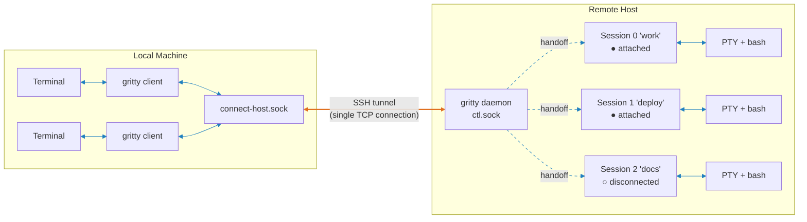
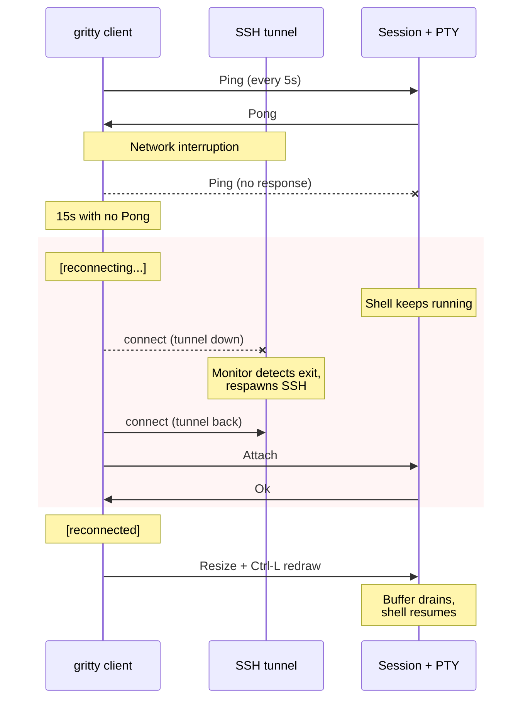
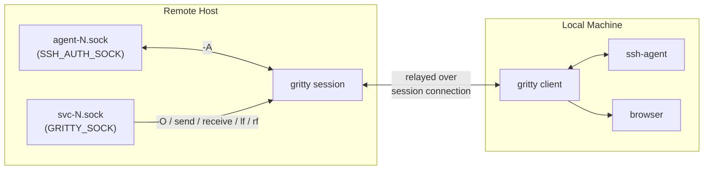

# gritty

Persistent remote shells that bring your local tools with them.

> **Early stage.** Works on Linux and macOS. Available on [crates.io](https://crates.io/crates/gritty-cli). Expect rough edges -- patches welcome.

```bash
gritty new devbox:work -A -O        # connect, forward SSH agent + browser/OAuth

# Inside the session -- your local tools just work:
git push                            # uses your local SSH keys via -A
gh auth login                       # OAuth opens in your local browser via -O
gritty lf 8080                      # quick-check a remote web server locally
gritty rf 5432                      # let the session reach local postgres
```

Close your laptop, change wifi, open it back up: you're exactly where you left off.

It works by forwarding Unix domain sockets over SSH -- no custom protocol, no open ports, no certificates, no configuration. If you can `ssh` to a host, you can use gritty.

### Install

Install on **both your laptop and the remote host**:

```bash
cargo install gritty-cli
```

### Quick Start

For first-time setup, use `--foreground` so you can accept the host key and enter your password if needed:

```bash
gritty connect --foreground devbox   # set up tunnel (Ctrl-C when done)
```

After that, one command creates a session and connects -- auto-starting the tunnel and remote server:

```bash
gritty new devbox:work -A -O
```

Transfer files through the session (run one side locally, one remotely):

```bash
gritty send file1.txt file2.txt     # auto-detects which session to use
gritty receive /tmp/dest

command | gritty send --stdin        # pipe mode
gritty receive --stdout | command
```

Detach and reattach from anywhere:

```bash
# Detach with ~. or just close your terminal

gritty attach devbox:work           # reattach from any terminal, any machine
gritty ls devbox                    # list sessions
gritty tunnels                      # list active tunnels
```

For local sessions (useful for testing): `gritty new local:scratch`

## Features

- **Self-healing connections** -- heartbeat detection, automatic tunnel respawn, transparent reconnect
- **Persistent sessions** -- shells survive disconnect, network failure, laptop sleep; reattach from any terminal or machine
- **SSH agent forwarding** (`-A`) -- `git push`, `ssh`, and other agent-dependent commands work remotely
- **URL open forwarding** (`-O`) -- `$BROWSER` requests forwarded to your local machine, with automatic OAuth callback tunneling
- **Port forwarding** -- `gritty local-forward` / `gritty remote-forward` for transient TCP forwards through the session; for persistent ports, configure SSH forwarding on the tunnel via `-o` or config
- **File transfer** -- `gritty send` / `gritty receive` through the session connection, with `--stdin`/`--stdout` pipe mode
- **Read-only tail** -- `gritty tail` streams session output without detaching the active client
- **Environment forwarding** -- TERM, LANG, COLORTERM propagated to the remote shell
- **Single binary, zero config** -- optional TOML config for per-host defaults; no port allocation, no root required
- **No network protocol** -- Unix domain sockets locally, SSH handles encryption and auth
- **Multiple named sessions** -- create, list, attach, kill by name or ID
- **SSH-style escape sequences** -- `~.` detach, `~^Z` suspend, `~?` help

## Commands

| Command | Aliases | Description |
|---------|---------|-------------|
| `gritty new-session <host[:name]>` | `new` | Create a session and auto-attach |
| `gritty attach <host:session>` | `a` | Attach to a session (`-c` creates if missing) |
| `gritty tail <host:session>` | `t` | Read-only stream of session output |
| `gritty list-sessions [host]` | `ls`, `list` | List sessions (no args = all daemons) |
| `gritty kill-session <host:session>` | | Kill a session |
| `gritty kill-server <host>` | | Kill the server and all sessions |
| `gritty connect <destination>` | `c` | Set up SSH tunnel to remote host |
| `gritty disconnect <name>` | `dc` | Tear down an SSH tunnel |
| `gritty tunnels` | `tun` | List active SSH tunnels |
| `gritty send [-r] [files...]` | | Send files/directories to a paired receiver |
| `gritty receive [dir]` | | Receive files from a paired sender |
| `gritty local-forward <port>` | `lf` | Forward a TCP port from session to client |
| `gritty remote-forward <port>` | `rf` | Forward a TCP port from client to session |
| `gritty open <url>` | | Open a URL on the local machine (inside sessions) |
| `gritty info` | | Show diagnostics (version, config, server status, tunnels) |
| `gritty config-edit` | | Open config in `$VISUAL`/`$EDITOR` (creates from template if missing) |
| `gritty completions <shell>` | | Generate shell completions (bash, zsh, fish, elvish, powershell) |

`<host>` is a connection name from `gritty connect`, or `local` for the local server. Session is specified after a colon: `host:session`. Auto-starts server/tunnel on `new`; `attach` waits for an existing server. `send`/`receive` auto-detect the session across all active daemons; use `--session host:session` to target a specific one.

**Global options:**
- `-v` / `--verbose`: enable debug logging
- `--ctl-socket <path>`: override the server socket path

**Session options** (`new`/`attach`):
- `-A` / `--forward-agent`: forward your local SSH agent
- `-O` / `--forward-open`: forward URL opens to local machine
- `--no-redraw`: don't send Ctrl-L after connecting
- `--no-escape`: disable escape sequence processing
- `--no-oauth-redirect`: disable OAuth callback tunneling (part of `-O`)
- `--oauth-timeout <seconds>`: OAuth callback accept timeout (default: 180)
- `-w` / `--wait` (`new` only): wait indefinitely for the server

**Connect options:**
- `-n <name>`: override connection name (defaults to hostname)
- `-o <option>` / `--ssh-option`: extra SSH options (repeatable, e.g., `-o "ProxyJump=bastion"`)
- `--no-server-start`: don't auto-start the remote server
- `--dry-run`: print SSH commands instead of running them
- `-f` / `--foreground`: run in the foreground instead of backgrounding

**Send/receive options:**
- `--session host:session`: target a specific session
- `--stdin` (`send`): read data from stdin instead of files
- `--stdout` (`receive`): write data to stdout instead of files

**Port forwarding:** port spec is `PORT` (same on both ends) or `LISTEN:TARGET`. Runs inside a session (`GRITTY_SOCK` required). Ctrl-C stops the forward. These are transient, on-demand forwards -- great for quick checks during development. For always-on port forwarding, configure it on the SSH tunnel instead: `gritty connect devbox -o "LocalForward=8080 localhost:8080"` or add it to `ssh-options` in your config file.

## Configuration

gritty works out of the box with no config file. Optionally, set persistent defaults in `$XDG_CONFIG_HOME/gritty/config.toml` (default: `~/.config/gritty/config.toml`). Run `gritty config-edit` to create and open the config file.

```toml
# Global defaults for all sessions/connections.
[defaults]
# forward-agent = false
# forward-open = false
# no-escape = false
# no-redraw = false
# oauth-redirect = true
# oauth-timeout = 180

# Connect-specific global defaults.
[defaults.connect]
# ssh-options = []
# no-server-start = false

# Per-host overrides, keyed by connection name.
# Connection name = hostname from destination, or -n override.
[host.devbox]
forward-agent = true
forward-open = true

[host.devbox.connect]
ssh-options = ["IdentityFile=~/.ssh/devbox_tunnel_key"]

[host.prod]
forward-open = true
no-escape = true

[host.prod.connect]
no-server-start = true
```

**Precedence:** CLI flag > `[host.<name>]` > `[defaults]` > built-in default. For `ssh-options`, values are appended (CLI first, then host, then defaults; SSH first-match gives earlier options priority).

A missing or malformed config file is silently ignored. Use `gritty info` to check config status.

## Escape Sequences

After a newline (or at session start), `~` enters escape mode:

| Sequence | Action |
|----------|--------|
| `~.` | Detach from session (clean exit, no auto-reconnect) |
| `~R` | Force reconnect |
| `~#` | Session status and RTT |
| `~^Z` | Suspend the client (SIGTSTP) |
| `~?` | Print help |
| `~~` | Send a literal `~` |

## Shell Completions

```bash
# Bash
gritty completions bash > /etc/bash_completion.d/gritty

# Zsh -- put in fpath and ensure compinit runs after:
mkdir -p ~/.zfunc
gritty completions zsh > ~/.zfunc/_gritty
# Add to .zshrc (before compinit):  fpath=(~/.zfunc $fpath)
# Then: rm -f ~/.zcompdump && exec zsh

# Fish
gritty completions fish > ~/.config/fish/completions/gritty.fish
```

## Design

### No Network Protocol

gritty contains zero networking code. Sessions live on Unix domain sockets. For remote access, you forward the socket over SSH -- the same SSH that already handles your keys, your `.ssh/config`, your bastion hosts, your MFA.

No ports to open, no firewall rules, no TLS certificates, no authentication system to trust beyond the one you already use.

### Security by Composition

gritty delegates encryption and authentication to SSH rather than reimplementing them. Locally, the socket is `0600`, the directory is `0700`, and every `accept()` verifies the peer UID. The attack surface is small because there's very little to attack.

### Single-Socket Architecture

All communication -- control messages and session relay -- flows through one server socket. When a client connects to a session, the server hands off the raw connection and gets out of the loop. No per-session sockets, no port allocation, no cleanup races.

### Persistence Model

The PTY and shell process keep running when the client disconnects. While disconnected, the server drains PTY output into a userspace ring buffer (1MB cap) so the shell never blocks -- long builds complete in the background. On reconnect, buffered output is flushed to the new client. There's no scroll-back replay or screen reconstruction -- just a live PTY that never dies.

## How It Works

### Architecture



<sub>Orange = SSH tunnel (TCP) · Blue = Unix domain socket</sub>

A daemon listens on a single Unix socket (`ctl.sock`). Clients send a control frame declaring intent (new session, attach, list); the daemon hands off the raw socket connection to the target session and gets out of the loop. Each session owns a PTY with a login shell that persists across disconnects -- while no client is attached, the server drains PTY output into a ring buffer so the shell never blocks. On reconnect, buffered output is flushed to the new client.

For remote access, `gritty connect` forwards the remote socket over SSH. All commands work identically over the tunnel.

### Self-Healing Reconnect



The client pings every 5 seconds; no pong within 15 seconds means dead connection. The client enters a reconnect loop (retry every 1s, Ctrl-C to abort). Meanwhile, the tunnel monitor detects the SSH process exit and respawns it. The client reconnects through the restored tunnel transparently.

### Agent & URL Forwarding



Forwarding multiplexes over the existing session connection -- no extra tunnels.

**SSH agent** (`-A`): the session creates `agent-N.sock` and sets `SSH_AUTH_SOCK`. When a remote process (e.g. `git push`) connects, the request is relayed to the client's local SSH agent and back.

**URL open** (`-O`): the session sets `GRITTY_SOCK` and `BROWSER=gritty open`. When `gritty open <url>` runs, the URL is relayed to the client which opens it locally. **OAuth callback tunneling:** if the URL contains a `redirect_uri` pointing to `localhost` or `127.0.0.1`, gritty automatically creates a single-use reverse TCP tunnel so the OAuth callback reaches the remote program -- this binds a TCP port on your local machine for the duration of the callback. This handles the common case where a CLI tool opens a browser for OAuth login and waits for the redirect on a local port. Disable with `--no-oauth-redirect`; adjust the accept timeout with `--oauth-timeout <seconds>` (default: 180). Note that `-O` is a trust grant -- it gives processes inside the remote session the ability to open URLs and bind TCP ports on your local machine. Only use it with sessions you control.

## Comparison

|  | **gritty** | [**mosh**](https://mosh.org/) | [**ET**](https://eternalterminal.dev/) | **autossh + tmux** |
|--|:--:|:--:|:--:|:--:|
| Survives network change | yes | yes | yes | yes |
| Survives client reboot | yes | no | no | yes |
| Auto-reconnect | yes | yes | yes | autossh only |
| SSH agent forwarding | yes | [no](https://github.com/mobile-shell/mosh/issues/120) | [no](https://github.com/MisterTea/EternalTerminal/issues/41) | [stale socket](https://werat.dev/blog/happy-ssh-agent-forwarding/) |
| Browser / URL forwarding | yes | no | no | no |
| OAuth callback tunneling | yes | no | no | no |
| Port forwarding | yes | no | yes | SSH -L/-R |
| File transfer | yes | no | no | scp/rsync |
| Predictive local echo | no | yes | no | no |
| Scroll-back / panes | no | no | no | tmux |
| No extra ports / firewall | yes | no (UDP) | no (TCP) | yes |
| IP roaming (mobile) | reconnect | seamless | reconnect | reconnect |
| Windows client | no | no | no | yes |
| Maturity | early | mature | mature | mature |

**Where gritty wins:** seamless local-tool integration. SSH agent forwarding that survives reconnects without stale sockets. Browser opens and OAuth flows that just work remotely. Port forwarding and file transfer multiplexed over the session -- no extra tunnels or tools. Stateless client -- reboot your laptop, `gritty attach` picks up where you left off.

**Where gritty loses:** no predictive local echo (mosh is unbeatable on high-latency links), no scroll-back or window management (use tmux inside gritty), no Windows support, and it's early-stage software.

**gritty + tmux** is the ideal pairing. gritty handles the connection -- self-healing tunnels, agent forwarding, auto-reconnect -- while tmux handles the workspace -- splits, windows, copy-mode, scroll-back. Run tmux inside a gritty session and close your laptop, change wifi, open it back up: your tmux splits are exactly where you left them, no re-SSH and `tmux attach` required. gritty replaces the fragile SSH pipe underneath tmux, not tmux itself.

## Status

Early stage. Works on Linux and macOS. No Windows support yet -- patches welcome. Available on [crates.io](https://crates.io/crates/gritty-cli).

## License

MIT OR Apache-2.0
