# Tunnel state machine

Gritty's SSH tunnel supervisor (`src/connect.rs`) has enough moving parts --
lockfile ownership, ssh child lifecycle, app-layer probing, exponential backoff,
remote server re-priming -- that the behavior is easier to reason about as an
explicit state machine than by reading the code top-to-bottom.

This document is the source of truth for that state machine. When you change
`connect.rs`, update the diagram and the state notes below **in the same
commit**.

## Scope

Covered:

- `tunnel-create` startup path (`connect::run`).
- Supervisor loop (`connect::tunnel_monitor`): ssh child lifecycle, app-layer
  probing, respawn/backoff, remote-ready re-priming.
- Shutdown path (`ConnectGuard::drop`, `disconnect`).
- Externally observable status (`probe_tunnel_status` -> `TunnelStatus`).

Not covered (separate concerns, documented elsewhere):

- Client reconnect loop (see `ARCHITECTURE.md`, `## Self-Healing Reconnect`).
- Session-layer takeover and ownership ([internals.md](internals.md), Device-based ownership).

## On-disk artifacts

A tunnel named `NAME` owns these files in `socket_dir()`:

| File                    | Writer                                   | Purpose |
|-------------------------|------------------------------------------|---------|
| `connect-NAME.lock`     | `try_acquire_lock` (flock exclusive)     | Liveness: flock held == supervisor alive. |
| `connect-NAME.pid`      | `run()` immediately after lock acquired  | Target for `disconnect`'s SIGTERM. |
| `connect-NAME.sock`     | `ssh -L` bind target                     | Client connects here to reach remote `ctl.sock`. |
| `connect-NAME.dest`     | `run()` after socket is up               | Original destination string, for `restart` / auto-start recovery. |
| `connect-NAME.info`     | `run()` via `runinfo`                    | Protocol version + git hash + exe of the running supervisor; the staleness signal `doctor`/`refresh` read. |
| `connect-NAME.ssh-opts` | `run()` after socket is up               | Pre-merge CLI `-o` options (one per line), replayed on `restart` / auto-start via `tunnel_recreate_args`. Config `ssh-options` are re-resolved and not stored here. |
| `connect-NAME.log`      | tracing subscriber                       | Supervisor's own structured logs. |
| `connect-NAME.out`      | daemonize stderr redirection             | ssh child's stderr (forward-setup errors, etc.). |
| `connect-NAME.remote-sock` | `run()` after post-bind probe succeeds | Cache of remote `ctl.sock` path. Survives teardown so subsequent connects can skip the Preflight `ensure_remote_ready` SSH-exec. |

Invariant: the flock held on the `.lock` *inode* is the single liveness truth.
Everything else is advisory -- if the inode's flock is free, any other leftover
file is stale by definition.

The subtle corollary: the flock is held on an *inode*, but `is_lock_held()`
probes the *path*. If the lock file is unlinked out from under a running
supervisor (external `rm`, a `/tmp` sweeper, or a pre-fix racy cleanup), the
supervisor keeps a valid flock on a deleted inode while the path reports the
lock as free. To keep age-based `/tmp` sweepers (macOS `tmp_cleaner` runs at
midnight; `dirhelper` uses a 3-day threshold) from being that external `rm`,
the supervisor touches the lock file's atime/mtime via `refresh_lock_mtime` on
every `PROBE_INTERVAL` tick and every respawn-backoff iteration -- the file is
otherwise write-once and would age out under a multi-day supervisor. A fresh `tunnel-create` then `O_CREAT`s a new inode and becomes
the observable owner -- two supervisors exist concurrently, only one visible.

Three guards keep that state from becoming destructive:

1. **`ConnectGuard::drop` ownership check.** At startup the supervisor snapshots
   `LockIdentity { dev, ino }` from its held flock fd. On drop it compares
   that against `stat(lock_path)`: if they differ (the path was replaced or
   removed), the supervisor is a ghost and removes **nothing** -- the real
   owner's `.sock`/`.pid`/`.info`/`.dest`/`.ssh-opts`/`.lock` all survive. When the
   identities match, it unlinks the sidecar files *while still holding the
   flock* (a racing `O_CREAT` after the unlink gets a brand-new inode and
   flocks it independently) and releases the flock last.

2. **`cleanup_if_unheld` for external observers.** `disconnect` and
   `get_tunnel_info` used to probe `is_lock_held()` and then unlink by path,
   a TOCTOU window where a new supervisor could acquire the lock between probe
   and unlink. `cleanup_if_unheld` instead acquires the flock non-blocking: if
   it succeeds, nothing live held the lock *and* nothing can sneak in while we
   hold it; if it fails, a supervisor is alive and cleanup is a no-op.

3. **Monitor self-heal.** On each probe tick the monitor calls
   `lock_still_owned(lock_identity, lock_path)`. If the lock path no longer
   points at the snapshotted inode, the supervisor exits; `ConnectGuard::drop`
   then sees the mismatch and leaves the owner's files alone. This converges a
   ghost-supervisor state within one `PROBE_INTERVAL` (30s) instead of letting
   a pair of duelling supervisors run indefinitely. The same
   `lock_still_owned` check also runs at the top of every respawn-loop
   iteration: the `probe_ticker` arm does not fire while control is inside the
   respawn loop, so without this a ghost stuck respawning through a long
   outage could spin for hours and then `spawn_tunnel` -> `remove_file` the
   real owner's socket. On a lost-ownership result the supervisor returns
   immediately.

## State diagram

```mermaid
stateDiagram-v2
    direction LR

    [*] --> Absent

    Absent --> WaitingForPeer: try_acquire_lock fails\n(peer supervisor alive)
    Absent --> Starting: try_acquire_lock ok\n(write .pid, clean stale files)

    WaitingForPeer --> [*]: wait_for_socket ok\n(print socket path, exit 0)
    WaitingForPeer --> Failed: wait_for_socket timeout
    WaitingForPeer --> Failed: peer released flock\n(supervisor died mid-startup)

    state Starting {
        direction TB
        [*] --> Preflight
        Preflight --> Preflight: ensure_remote_ready\n(ssh, socket path, server start)
        Preflight --> SpawnChild: got remote_sock and version\n(version check, may bail)
        SpawnChild --> WaitForSocket: ssh spawned\n(stderr drained to .out)
        WaitForSocket --> Ready: UnixStream.connect ok
        WaitForSocket --> ChildDiedEarly: child.wait() won the select\n(ssh exited before socket bind)
        WaitForSocket --> SocketTimeout: wait_for_socket deadline\n(ssh alive but never bound the forward socket)
    }

    Starting --> Running: Ready\n(write .dest, signal_ready,\nspawn tunnel_monitor)
    Starting --> Failed: ChildDiedEarly\n(bail, point at .out)
    Starting --> Failed: SocketTimeout\n(bail, point at foreground hint)

    state Running {
        direction LR
        [*] --> Alive
        Alive --> Alive: probe_tunnel_alive ok\n(Hello / HelloAck / ListSessions,\nreset failure counter)
        Alive --> ProbeFailing: probe failed\n(counter++)
        ProbeFailing --> Alive: next probe ok
        ProbeFailing --> KillingChild: counter >= 2\n(kill ssh; counter resets when the\nreplacement child is installed)
        Alive --> KillingChild: net path changed\n+ one-shot probe failed\n(macOS only; gated on uptime >= 5s)
        Alive --> ChildExited: child.wait() returned
        KillingChild --> ChildExited: child.wait() observes kill

        ChildExited --> NonTransient: exit code 0, or 1..=254\nexcluding 128..=159
        ChildExited --> Backoff: exit code 255,\nsignal death (128..=159),\nor no code (local signal)\nsleep derived once from this exit:\n0s if we killed ssh ourselves,\n1s if uptime >=30s, else prior backoff
        NonTransient --> [*]: warn, monitor returns
        Backoff --> Backoff: retry failed\n(sleep, then double backoff\nto <=60s)
        Backoff --> EnsureRemoteRetry: timer fires
        Backoff --> EnsureRemoteRetry: net path changed\n(macOS; cut sleep to 1s,\nnext backoff 2s)
        EnsureRemoteRetry --> Backoff: ensure_remote_ready err\n(retry from top)
        EnsureRemoteRetry --> SpawnRetry: got fresh remote_sock
        SpawnRetry --> Alive: ssh respawned\n(update child_spawned_at)
        SpawnRetry --> Backoff: spawn_tunnel err
    }

    note right of Running
        Externally observable via probe_tunnel_status.
        Alive and ProbeFailing map to TunnelStatus.Healthy
        (socket still bound; probe failure has not
        yet killed the child).
        KillingChild, ChildExited, Backoff,
        EnsureRemoteRetry, and SpawnRetry map to
        TunnelStatus.Reconnecting
        (flock held; socket gone or wedged).
    end note

    note left of Starting
        Also maps to TunnelStatus.Reconnecting
        from outside. flock held, socket not yet
        bound. The client reconnect grace relies
        on this so it does not give up during a
        slow initial tunnel setup.
    end note

    Running --> Stopping: SIGTERM / SIGINT\n(run() select;\ninterrupts Backoff sleep too)
    Running --> Stopping: monitor returned\n(NonTransient exit)
    Running --> Stopping: stop.cancelled()\n(ConnectGuard drop)

    state Stopping {
        direction TB
        [*] --> CancelMonitor: stop.cancel()
        CancelMonitor --> KillChild: monitor awaits child.kill()
        KillChild --> CheckOwnership: ConnectGuard.drop\n(SIGTERM ssh)
        CheckOwnership --> CleanupFiles: LockIdentity matches path
        CheckOwnership --> ReleaseFlock: path replaced / gone\n(ghost; leave owner's files alone)
        CleanupFiles --> ReleaseFlock: rm sock/pid/info/dest/\nssh-opts/lock\n(while flock still held)
        ReleaseFlock --> [*]: drop Flock
    }

    Stopping --> [*]

    Failed --> [*]: bail with diagnostic
```

## External observability

From another process (e.g. `gritty tunnels`, `gritty info`, the client's
reconnect grace window), status is projected to three externally visible
values via `probe_tunnel_status(name) -> TunnelStatus`:

| Observed                                     | `TunnelStatus`  | Internal states that produce it |
|----------------------------------------------|-----------------|---------------------------------|
| lock held + `.sock` connectable              | `Healthy`       | `Running.Alive`, `Running.ProbeFailing` (socket stays bound during probe; a failing probe has not yet killed the ssh child) |
| lock held + `.sock` not connectable          | `Reconnecting`  | `Starting.Preflight`, `Starting.SpawnChild`, `Starting.WaitForSocket` (initial setup), plus `Running.KillingChild`, `Running.ChildExited`, `Running.Backoff`, `Running.EnsureRemoteRetry`, `Running.SpawnRetry` (respawn cycle) |
| lock free                                    | `Stale`         | Supervisor absent / dead; `.sock`/`.pid` orphaned. `get_tunnel_info` GCs stale files as a side effect via `cleanup_if_unheld` (acquires the flock before touching anything, so a supervisor that races in between the probe and the GC is unaffected). |

The `Starting.*` row matters for the client observer: during a slow
initial tunnel setup (cellular RTT, remote cold-start), the client sees
lock-held + socket-missing and must keep retrying past its own
`SOCKET_GONE_GRACE` window -- same treatment as a respawn cycle. The
state machine deliberately makes these indistinguishable from outside.

The client's reconnect loop (`src/client.rs`) uses `is_lock_held` directly,
not `TunnelStatus`: a held lock means "supervisor is alive and may be
respawning" -- keep retrying past `SOCKET_GONE_GRACE` -- while a free lock
means "tunnel is gone". This distinction is what lets a 1..60s ssh
backoff not trip the client's short socket-gone grace.

A free lock is **not** an instant terminal verdict, though. The client
requires the "stale socket (`ECONNREFUSED`) + free lock" signature to persist
past `DAEMON_GONE_GRACE` (5s, tracked via `PersistenceGate`) before it gives up
with `daemon_gone_message`. Wake-from-suspend is why: the client's heartbeat
tick routinely fires a second before the supervisor's suspend poll, and a
transient *ghost lock* (an orphaned `.lock` file no live supervisor holds) can
make `is_lock_held` read false for a tunnel whose remote daemon is still alive.
Without the grace window a single unlucky probe at wake permanently killed every
session (observed in the field). The terminal message is also tunnel-aware: for
a remote session it points at `gritty connect` (the remote daemon is likely
fine; only the forward is down) and never suggests `gritty restart`, which would
kill the remote daemon and its live sessions.

## Transition details

### Startup (`connect::run`)

1. **Absent -> WaitingForPeer** -- `try_acquire_lock` returned `Err`. Another
   supervisor holds the flock. This process must not spawn a second ssh
   child: the socket path is shared and the invocation is expected to be
   idempotent (`auto_start` relies on "`tunnel-create` exit 0 ==> socket is
   ready"). We fall through to `wait_for_socket` to absorb the startup race,
   then signal ready and exit. The wait races against a concurrent
   `is_lock_held` poll so a peer supervisor that crashes during its own
   startup surfaces as a fast, diagnosable error instead of forcing us to
   wait the full `socket_wait_deadline`.
2. **Absent -> Starting** -- `try_acquire_lock` returned `Ok`. We own the
   supervisor role. Clean any stale `.sock`/`.pid`/`.info`/`.dest`/`.ssh-opts` (we
   don't remove the lock we just acquired), then write the `.pid` file **immediately**
   so `disconnect` can find us during the startup window. A `LockFileBailGuard`
   is armed here too: if the fallible setup that follows (`ensure_remote_ready`,
   version gate, `spawn_tunnel`, `wait_for_socket`) returns early, dropping
   `lock_fd` releases the advisory lock but would leave the `.lock` *file* on
   disk -- an orphaned ghost lock. The guard removes that file on early bail
   (only while we still own the inode, via `lock_still_owned`) and is disarmed
   once `ConnectGuard` takes over cleanup. This matters at wake-from-suspend:
   an auto-start `tunnel-create` can grab the lock and then fail in
   `ensure_remote_ready` because the SSH agent (e.g. a Secure-Enclave signer)
   is still locked -- exactly the window that used to strand a ghost lock.
3. **Starting.Preflight -> Starting.SpawnChild** -- if
   `connect-NAME.remote-sock` exists, use its contents as `remote_sock`
   and skip `ensure_remote_ready` entirely (saves one ~2s SSH-exec on
   every connect after the first). Otherwise `ensure_remote_ready`
   returns `(remote_sock, remote_version)`; version mismatch bails unless
   `--ignore-version-mismatch` (predates the in-band v15 mismatch
   recovery, still used as a pre-flight for `tunnel-create` since we
   can't talk to the remote daemon without ssh). On the cached fast path
   no version is known here, so the same version gate
   (`check_remote_protocol_version`) is deferred to the post-bind probe
   in step 5 -- the cached path must not silently skip it.
4. **Starting.SpawnChild -> Starting.WaitForSocket** -- ssh spawned. With
   `isolate_control_path` (the default) it uses `-N`: no remote process,
   so a half-open drop (local ssh exits on `ServerAliveInterval`; remote
   sshd waits ~2h for TCP keepalive) leaks nothing user-visible on the
   remote. When riding a mux (`isolate_control_path=false`), `-N` would
   make the mux client exit 0 immediately after the master accepts the
   forward, so instead `exec sleep 2147483647` is used as the remote
   command to keep a session channel open -- this can leak `sleep`
   processes on the remote across half-open drops. Stderr is
   drained to our stderr (== `.out` in daemonized mode) so mux errors like
   `mux_client_forward: forwarding request failed` surface without waiting
   for `wait_for_socket` to time out.
5. **Starting.WaitForSocket -> Running / Failed** -- the select has two
   failure branches, surfaced as distinct states in the diagram:
   - **ChildDiedEarly** (`child.wait()` wins): ssh exited before binding
     the `-L` socket. Bail with a diagnostic pointing the user at `.out`
     (where the child's stderr drained to). Root causes: bad forward
     spec, `ExitOnForwardFailure=yes` tripping, remote host rejected
     the connection after auth.
   - **SocketTimeout** (`wait_for_socket` deadline): ssh is still alive
     but never called bind() on the forward. Bail with a diagnostic
     that additionally points at the `--foreground` hint (a password
     prompt that wasn't answered is the common cause).

   On socket-ready first, run one `probe_tunnel_alive` against the local
   socket to confirm the forward actually reaches a live remote daemon.
   The probe returns the remote's protocol version from its `HelloAck`.
   On the cached-`remote_sock` fast path this is the only liveness
   check (we skipped `ensure_remote_ready`): probe failure re-runs
   `ensure_remote_ready`; if it returns a different path the cache was
   stale -- invalidate `.remote-sock` and bail so a retry takes the slow
   path. On the slow path the probe is belt-and-suspenders. On the cached
   path the probed version is then run through the step-3 version gate
   (`check_remote_protocol_version`) -- without this a cached connect to a
   freshly-upgraded remote would succeed silently. Then write `.dest` +
   `.remote-sock`, call `signal_ready` so the parent `tunnel-create`
   process exits, and hand the ssh child to `tunnel_monitor`.

### Supervisor loop (`tunnel_monitor`)

The monitor runs a `tokio::select!` with five arms:

- **`stop.cancelled()`** -- kill ssh child and return.
- **`net.changed()`** (macOS only) -- OS network path changed; record
  whether any event in the burst reported `Unsatisfied`, and arm (or
  reset) the debounced-probe timer (`NET_PROBE_DEBOUNCE`, 500ms). This
  arm never probes itself -- it only schedules.
- **Debounce timer fires** (the armed `net_probe_at` sleep) -- 500ms
  passed with no further path event. If no `Unsatisfied` was
  seen since the last successful probe, skip -- a purely-`Satisfied` burst
  is interface-property noise, and a transient HelloAck timeout on such a
  probe would kill a working SSH (ServerAlive still covers a genuine
  seamless route switch in ~6-9s). Otherwise run one `probe_tunnel_alive`
  and kill ssh on failure (single-strike). The debounce exists because
  `nw_path_monitor` bursts during wifi renegotiation; probing on the first
  event races the sub-second outage itself. The kill is further gated on
  `state.past_spawn_grace()` (`uptime >= SPAWN_GRACE`, 5s) -- a fresh ssh
  whose `-L` hasn't bound yet isn't killed by its own startup race.
- **`probe_ticker.tick()`** -- every 30s, run `probe_tunnel_alive` against
  the local socket. The probe does `Hello -> HelloAck -> ListSessions` with
  a 3s outer timeout and 1s inner timeouts. This catches remote-daemon death
  (OOM, crash, manual kill) that ssh can't see: ssh's `ServerAliveInterval`
  only covers TCP-layer liveness. Two consecutive probe failures kill the
  ssh child to force a respawn that re-runs `ensure_remote_ready`. One
  transient probe failure is recoverable and does not kill ssh.
- **`child.wait()`** -- ssh exited. Classify the exit code:
  - codes `1..=254` except `128..=159` are non-transient (auth/config
    errors); log and return without retry.
  - code `255` (ssh connection error), codes `128..=159` (signal death
    from the remote side: reboot, OOM, SIGTERM during shutdown), and `None`
    (local signal-kill, typically our own `child.kill()` from the probe
    arm) are all transient -- retry. The first sleep is derived **once**
    from this exit: zero when the supervisor killed the child itself
    (`we_killed` -- the kill was a deliberate respawn decision, so waiting
    would only add latency; this zero-sleep path is load-bearing), 1s when
    the child had been up >= 30s (`HEALTHY_CHILD_THRESHOLD`), else the
    prior `backoff`. It is *not* re-derived per retry -- a long-dead
    child's ever-growing uptime would otherwise pin backoff at 1s and
    hammer the remote.
- The respawn sequence (`Backoff` sleep -> `ensure_remote_ready` ->
  `spawn_tunnel`) is an **inner loop**: a failure in either step sleeps the
  current `backoff`, doubles it (capped at 60s), and retries locally. It
  does NOT `continue` to the outer select -- doing so re-resolved
  `child.wait()` with the cached status and re-applied the healthy-uptime
  reset on every retry, which pinned backoff at 1s and hammered the remote
  with auth attempts during macOS dark wakes (Keychain agent refuses to
  sign while locked).
- The `Backoff` sleep races `stop.cancelled()`, `net.changed()`, and a
  2s suspend-detect ticker. A path-change only short-circuits on the
  `Unsatisfied -> Satisfied` edge; pure-`Satisfied` noise (which
  `nw_path_monitor` emits during dark wakes too) is ignored so it can't
  defeat the climb. The suspend ticker compares wall-clock vs monotonic
  elapsed since the sleep started; a gap > `SUSPEND_JUMP_THRESHOLD` (5s)
  means the process was frozen -- cut this sleep short for one immediate
  attempt, but keep `backoff` at its climbed value so a dark wake with a
  locked Keychain costs exactly one failed auth before resuming the
  climb. This closes the "up to 60s after lid-open" gap that the edge
  detector alone can't, since the process can't observe the
  `Unsatisfied` that happened while it was frozen.
- Whenever a respawn succeeds, the "healthy threshold" logic
  (`spawned_at.elapsed() >= 30s` at the *next* exit) resets `backoff` back
  to 1s. That means a tunnel that dies five minutes into a stable run waits
  1s before retrying, not whatever the last `min(backoff * 2, 60s)` was.

### Re-priming the remote (`ensure_remote_ready` on respawn)

Between `Backoff` and `SpawnRetry`, we call `ensure_remote_ready` again.
Without this, a respawn after a remote reboot succeeds at the ssh/forward
layer but nothing is listening on the far end of the forward, so the first
client Hello hits EOF. The re-prime runs `gritty ls local || (gritty server
&& sleep 0.3)` so a rebooted host gets its daemon started before we point
ssh at its ctl socket. If `ensure_remote_ready` itself fails (ssh auth
problem, remote unreachable, etc.), we go back to `Backoff` -- we don't
try to spawn ssh against a stale `remote_sock`.

The re-prime is **skipped** when `last_healthy` (the most recent successful
app-layer probe, seeded from the caller's initial `ensure_remote_ready`; seeded
to `None` when the initial `remote_sock` is empty) is within
`SKIP_ENSURE_REMOTE_THRESHOLD` (60s) *and* the cached `remote_sock` is
non-empty. A sub-minute network blip can't
plausibly have rebooted the remote, and the ~2s SSH-exec round-trip is pure
reconnect latency on the common path. Beyond 60s we re-verify. `last_healthy`
is a `SystemTime` (wall-clock), not `Instant`, so time spent in laptop
suspend counts toward the threshold -- a 4-minute lid-close must re-prime.

### Shutdown

Two entry points into `Stopping`:

- **`ConnectGuard::drop`** (normal path) -- `run()` received SIGTERM/SIGINT,
  or fell out of the main `select!` because the monitor returned (e.g.
  non-transient exit). `Drop` cancels the stop token, SIGTERMs the ssh
  child directly as a belt-and-braces (the monitor also kills on cancel),
  then removes `.sock`, `.pid`, `.info`, `.dest`, `.ssh-opts`, `.lock`. The flock is
  released last when `_lock` drops.
- **`disconnect(name)`** (external command) -- reads `.pid`, sends SIGTERM,
  polls `is_lock_held` for up to 2s. If still held, escalates to SIGKILL
  plus `killpg` to catch any detached ssh children. Then calls
  `cleanup_if_unheld(name)`, which acquires the flock before sweeping the
  sidecar files and removes the lock file too (the plain
  `cleanup_stale_files` helper never touches the lock).

## Invariants

These must hold; violating them has in the past caused specific, nasty bugs:

1. **The flock is the ground truth for liveness.** Never infer "tunnel is
   up" from the presence of `.sock` or `.pid`. The supervisor can be mid-
   respawn (flock held, socket gone) for up to 60s.
2. **Write `.pid` before any slow startup step.** `ensure_remote_ready` +
   `spawn_tunnel` + `wait_for_socket` can take tens of seconds on WAN
   links. `disconnect` needs the PID immediately -- before v0.11.0 the
   PID was written only after socket-up, so `disconnect` during startup
   saw "lock held but no PID" and failed.
3. **`remote_sock` must be re-fetched on respawn** unless the tunnel was
   proven healthy within `SKIP_ENSURE_REMOTE_THRESHOLD` (see Re-priming
   above); otherwise a remote reboot / upgrade leaves the tunnel pointing
   at a dead daemon with no way to recover short of `tunnel-destroy`.
4. **Non-transient exit codes must not retry.** Auth failure, host-key
   mismatch, remote config error (`ExitOnForwardFailure=yes` tripping on
   a bad forward spec) all exit in `1..=254` excluding `128..=159`.
   Exit `0` is also classified non-transient -- a clean exit (e.g. a mux
   client whose master closed) is not a retry signal, so the supervisor
   warns and returns. Retrying any of these hammers the remote and buries
   the real error in a loop.
5. **Stderr drain must start immediately.** If ssh fills its stderr pipe
   buffer (~64KB) with forward-setup errors while we're blocked in
   `wait_for_socket`, ssh wedges and we never see the error. See
   `drain_stderr` in `connect.rs`.
6. **`stop.cancel()` must happen before `ConnectGuard` drops the child.**
   Otherwise the monitor's `child.wait()` arm may race the guard's SIGTERM
   and try to respawn a dying supervisor.

## Timing constants

| Constant                              | Value          | Location             | Rationale |
|---------------------------------------|----------------|----------------------|-----------|
| `ServerAliveInterval` / `CountMax`    | 3s / 2 (=6s)   | `TUNNEL_SSH_OPTS`    | TCP-layer dead-peer detection inside ssh. |
| `PROBE_INTERVAL`                      | 30s            | `tunnel_monitor`     | App-layer Hello handshake cadence. Longer than `ServerAliveInterval` so ssh catches TCP failures first. |
| `PROBE_FAILURES_BEFORE_RESPAWN`       | 2              | `tunnel_monitor`     | One missed probe can be a transient network blip; two in a row (60s window) is a confident "remote daemon is dead". |
| Probe outer timeout                   | 3s             | `probe_tunnel_alive` | Runs inside the supervisor select; slow probe blocks everything. |
| Probe inner (HelloAck) timeout        | 1s             | `probe_tunnel_alive` | Same. |
| Backoff min / max                     | 1s / 60s       | `tunnel_monitor`     | Aggressive first retry (usual case: transient ssh exit 255); cap at 60s to avoid hammering. |
| `HEALTHY_CHILD_THRESHOLD`             | 30s            | `tunnel_monitor`     | Tunnel alive this long before its next death resets backoff to 1s. |
| `NET_PROBE_DEBOUNCE`                  | 500ms          | `tunnel_monitor`     | Quiet window after a net path event before probing; `nw_path_monitor` bursts during wifi renegotiation. |
| `SPAWN_GRACE`                         | 5s             | `tunnel_monitor`     | Net-change single-strike kill is disabled until ssh has been up this long -- an infant ssh isn't killed by its own startup race. |
| `SUSPEND_JUMP_THRESHOLD`              | 5s             | `tunnel_monitor`     | Wall-vs-monotonic gap during a backoff sleep that indicates the process was frozen (suspend); cuts the sleep short for one attempt. |
| `SUSPEND_POLL`                        | 2s             | `tunnel_monitor`     | Cadence of the suspend-detect ticker racing the backoff sleep. |
| `SKIP_ENSURE_REMOTE_THRESHOLD`        | 60s            | `tunnel_monitor`     | Respawn skips the ~2s `ensure_remote_ready` re-prime when healthy within this window (wall-clock, so suspend counts). |
| `socket_wait_deadline(ct)`            | `max(5, ct)+10`s (60s if ct==0) | `wait_for_socket` | Bounds wait-for-socket polling; leaves headroom for ProxyCommand startup and forward setup. |
| `remote_exec` outer timeout           | 60s            | `remote_exec`        | Wall-clock ceiling on the whole ssh invocation; ServerAlive covers TCP hangs but not stuck shell profiles. |
| `disconnect` graceful deadline        | 2s             | `disconnect`         | SIGTERM -> poll for flock release. Escalates to SIGKILL + killpg after. |

## Client-observer coupling

The client's auto-reconnect loop reads the supervisor's flock via
`connect::is_lock_held` (through `ctl_socket_lock_path`). This is the only
cross-module coupling to the state machine, so it's worth stating the
contract explicitly:

> While the supervisor's flock is held, the client MUST assume the tunnel
> is alive-but-possibly-respawning, and keep retrying past its normal
> `SOCKET_GONE_GRACE` window. Only a free flock (== `TunnelStatus::Stale`)
> authorizes the client to give up -- and even then only after it has
> persisted past `DAEMON_GONE_GRACE`, so a transient ghost-lock window at
> wake-from-suspend can't be mistaken for a destroyed tunnel.

Changing supervisor behavior in a way that holds the flock without being
respawn-capable (for example, holding it in `Failed`) will break this
contract and cause clients to hang forever on destroyed tunnels.
